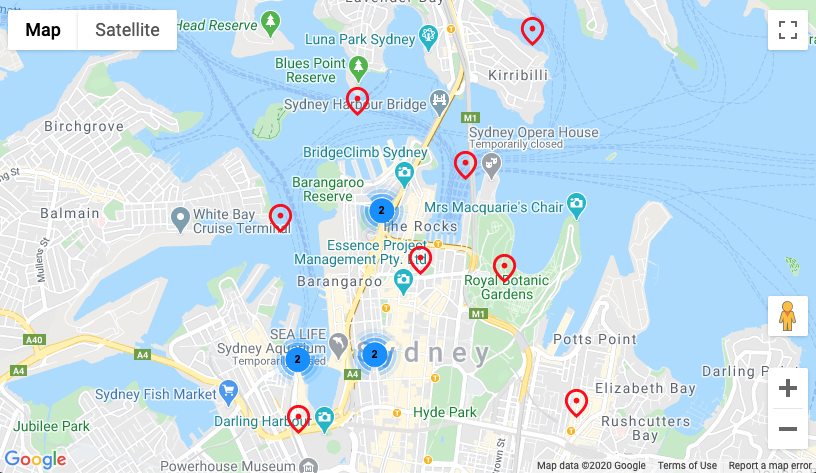

# Google Maps Platform 101: JavaScript Codelab

This repo contains the project template and finished code for the Google Maps Platform 101: JavaScript codelab.

## Getting Started
To get started with the codelab, download or fork this repo. A starter template is available in `/starter` and the full solution code is available in `/solution`.

To run the starter or solution apps, run the following from their respective directories:

1. `npm i`
2. `npm start`

This will install the needed dependencies and run the app locally in your browser using Webpack Dev Server.

## Support
If you find a bug, please [file an issue]. Or, if you'd like to contribute, send us a [pull request] and refer to our [code of conduct].

[codelab]: https://codelabs.developers.google.com/codelabs/maps-platform-101-js/index.html
[file an issue]: https://github.com/googlecodelabs/maps-platform-101-js/issues
[pull request]:  https://github.com/googlecodelabs/maps-platform-101-js/compare
[code of conduct]: CODE_OF_CONDUCT.md
